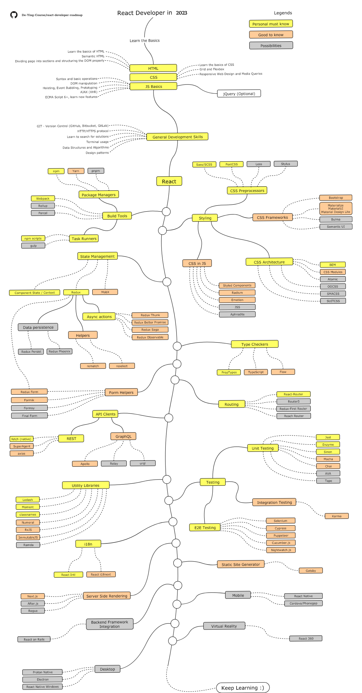

# React Developer Roadmap

> Roadmap to becoming a React developer in 2023:

Below you can find a chart demonstrating the paths that you can take and the libraries that you would want to learn to become a React developer. I made this chart as a tip for everyone who asks me, "What should I learn next as a React developer?"

## Disclaimer

> The purpose of this roadmap is to give you an idea about the landscape. The road map will guide you if you are confused about what to learn next, rather than encouraging you to pick what is hip and trendy. You should grow some understanding of why one tool would be better suited for some cases than the other and remember hip and trendy does not always mean best suited for the job

## Roadmap

## Resources

    
<b>Basics</b>

    

      
<b>HTML</b>

      <ul>
        <li>Learn the basics of HTML</li>
        <li>Make a few pages as an exercise</li>
      </ul>
    

    

      
<b>CSS</b>

      <ul>
        <li>Learn the basics of CSS</li>
        <li>Style pages from previous step</li>
        <li>Build a page with grid and flexbox</li>
      </ul>
    

    

        
<b>JS Basics</b>

        <ul>
          <li>Get familiar with the syntax</li>
          <li>Learn basic operations on DOM</li>
          <li>Learn mechanisms typical for JS (Hoisting, Event Bubbling, Prototyping)</li>
          <li>Make some AJAX (XHR) calls</li>
          <li>Learn new features (ECMA Script 6+)</li>
          <li>Additionally, get familiar with the jQuery library</li>
        </ul>
      

    
<b>General Development Skills</b>

    
1. Learn GIT, create a few repositories on GitHub, share your code with other people

    
2. Know HTTP(S) protocol, request methods (GET, POST, PUT, PATCH, DELETE, OPTIONS)

    
3. Don't be afraid of using Google, [Power Searching with Google](http://www.powersearchingwithgoogle.com/)

    
4. Get familiar with terminal, configure your shell (bash, zsh, fish)

    
Read a few books about algorithms and data structures

    
Read a few books about design patterns

    
<b>Learn React on [official website](https://reactjs.org/tutorial/tutorial.html) or complete some [courses](https://egghead.io/courses/the-beginner-s-guide-to-react)</b>

    
<b>Get familiar with tools that you will be using</b>

    

      
<b>Package Managers</b>

      <ul>
        <li>[npm](https://www.npmjs.com/)</li>
        <li>[yarn](https://yarnpkg.com/lang/en/)</li>
        <li>[pnpm](https://pnpm.js.org/)</li>
      </ul>
    

    

      
<b>Task Runners</b>

      <ul>
        <li>[npm scripts](https://docs.npmjs.com/misc/scripts)</li>
        <li>[gulp](https://gulpjs.com/)</li>
      </ul>
    

    

        
<b>...s</b>

        <ul>
          <li>[Webpack](https://webpack.js.org/)</li>
          <li>[Rollup](https://rollupjs.org/guide/en)</li>
          <li>[Parcel](https://parceljs.org/)</li>
        </ul>
      

    
<b>Styling</b>

    

      
<b>CSS Preprocessor</b>

      <ul>
        <li>[Sass/CSS](https://sass-lang.com/)</li>
        <li>[PostCSS](https://postcss.org/)</li>
        <li>[Less](http://lesscss.org/)</li>
        <li>[Stylus](http://stylus-lang.com/)</li>
      </ul>
    

    

      
<b>CSS Frameworks</b>

      <ul>
        <li>[Bootstrap](https://getbootstrap.com/)</li>
        <li>[Materialize](https://materializecss.com/), [Material UI](https://material-ui.com/), [Material Design Lite](https://getmdl.io/)</li>
        <li>[Bulma](https://bulma.io/)</li>
        <li>[Semantic UI](https://semantic-ui.com/)</li>
      </ul>
    

    

        
<b>CSS Architecture</b>

        <ul>
          <li>[BEM](http://getbem.com/)</li>
          <li>[CSS Modules](https://github.com/css-modules/css-modules)</li>
          <li>[Atomic](https://acss.io/)</li>
          <li>[OOCSS](https://github.com/stubbornella/oocss/wiki)</li>
          <li>[SMACSS](https://smacss.com/)</li>
          <li>[SUITCSS](https://suitcss.github.io/)</li>
        </ul>
      

       

        
<b>CSS in JS</b>

        <ul>
          <li>[Styled Components](https://www.styled-components.com/)</li>
          <li>[Radium](https://formidable.com/open-source/radium/)</li>
          <li>[Emotion](https://emotion.sh/)</li>
          <li>[JSS](http://cssinjs.org/)</li>
          <li>[Aphrodite](https://github.com/Khan/aphrodite)</li>
        </ul>
      

    
<b>State Management</b>

    

      
[Component State](https://reactjs.org/docs/faq-state.html)/[Context API](https://reactjs.org/docs/context.html)

    

    

        
<b>[Redux](https://redux.js.org/)</b>

        

            
<b>Async actions (Side Effects)</b>

            <ul>
                <li>[Redux Thunk](https://github.com/reduxjs/redux-thunk)</li>
                <li>[Redux Better Promise](https://github.com/Lukasz-pluszczewski/redux-better-promise)</li>
                <li>[Redux Saga](https://redux-saga.js.org/)</li>
                <li>[Redux Observable](https://redux-observable.js.org)</li>
            </ul>
        

        

            
<b>Helpers</b>

            <ul>
                <li>[Rematch](https://rematch.gitbooks.io/rematch/)</li>
                <li>[Reselect](https://github.com/reduxjs/reselect)</li>
            </ul>
        

        

            
<b>Data persistence</b>

            <ul>
                <li>[Redux Persist](https://github.com/rt2zz/redux-persist)</li>
                <li>[Redux Phoenix](https://github.com/adam-golab/redux-phoenix)</li>
            </ul>
        

         

            
<b>[Redux Form](https://redux-form.com)</b>

        

    

    

        
<b>[MobX](https://mobx.js.org/)</b>

      

    
<b>Type Checkers</b>

    
[PropTypes](https://reactjs.org/docs/typechecking-with-proptypes.html)

    
[TypeScript](https://www.typescriptlang.org/)

    
[Flow](https://flow.org/en/)

    
<b>Form Helpers</b>

    
[Redux Form](https://redux-form.com)

    
[Formik](https://github.com/jaredpalmer/formik)

    
[Formsy](https://github.com/formsy/formsy-react)

    
[Final Form](https://github.com/final-form/final-form)

    
<b>Routing</b>

    
[React-Router](https://reacttraining.com/react-router/)

    
[Router5](https://router5.js.org/)

    
[Redux-First Router](https://github.com/faceyspacey/redux-first-router)

    
[Reach Router](https://reach.tech/router/)

    
<b>API Clients</b>

    

      
<b>REST</b>

      <ul>
        <li>[Fetch](https://developer.mozilla.org/en-US/docs/Web/API/Fetch_API)</li>
        <li>[SuperAgent](https://visionmedia.github.io/superagent/)</li>
        <li>[axios](https://github.com/axios/axios)</li>
      </ul>
    

    

      
<b>GraphQL</b>

      <ul>
        <li>[Apollo](https://www.apollographql.com/docs/react/)</li>
        <li>[Relay](https://facebook.github.io/relay/)</li>
        <li>[urql](https://github.com/FormidableLabs/urql)</li>
      </ul>
    

    
<b>Utility Libraries</b>

    
[Lodash](https://lodash.com/)

    
[Moment](https://momentjs.com/)

    
[classnames](https://github.com/JedWatson/classnames)

    
[Numeral](http://numeraljs.com/)

    
[RxJS](http://reactivex.io/)

    
[ImmutableJS](https://facebook.github.io/immutable-js/)

    
[Ramda](https://ramdajs.com/)

    
<b>Testing</b>

    

      
<b>Unit Testing</b>

      <ul>
        <li>[Jest](https://facebook.github.io/jest/)</li>
        <li>[Enzyme](http://airbnb.io/enzyme/)</li>
        <li>[Sinon](http://sinonjs.org/)</li>
        <li>[Mocha](https://mochajs.org/)</li>
        <li>[Chai](http://www.chaijs.com/)</li>
        <li>[AVA](https://github.com/avajs/ava)</li>
        <li>[Tape](https://github.com/substack/tape)</li>
      </ul>
    

    

      
<b>End to End Testing</b>

      <ul>
        <li>[Selenium](https://www.seleniumhq.org/), [Webdriver](http://webdriver.io/)</li>
        <li>[Cypress](https://cypress.io/)</li>
        <li>[Puppeteer](https://pptr.dev/)</li>
        <li>[Cucumber.js](https://github.com/cucumber/cucumber-js)</li>
        <li>[Nightwatch.js](http://nightwatchjs.org/)</li>
      </ul>
    

    

      
<b>Integration Testing</b>

    

    
<b>Internationalization</b>

    
[React Intl](https://github.com/yahoo/react-intl)

    
[React i18next](https://react.i18next.com/)

    
<b>Server Side Rendering</b>

    
[Next.js](https://nextjs.org/)

    
[After.js](https://github.com/jaredpalmer/after.js)

    
[Rogue](https://github.com/alidcastano/rogue.js)

    
<b>Static Site Generator</b>

    
[Gatsby](https://www.gatsbyjs.org/)

    
<b>Backend Framework Integration</b>

    
[React on Rails](https://shakacode.gitbooks.io/react-on-rails/content/)

    
<b>Mobile</b>

    
[React Native](https://facebook.github.io/react-native/)

    
[Cordova](https://cordova.apache.org/)/[Phonegap](https://phonegap.com/)

    
<b>Desktop</b>

    
[Proton Native](https://proton-native.js.org/)

    
[Electron](https://electronjs.org/)

    
[React Native Windows](https://github.com/Microsoft/react-native-windows)

    
<b>Virtual Reality</b>

    
[React 360](https://facebook.github.io/react-360/)

## Wrap Up

If you think the roadmap can be improved, please do open a PR with any updates and submit any issues. Also, I will continue to improve this, so you might want to star this repository to revisit.

## Contribution

The roadmap is built using [Draw.io](https://www.draw.io/). Project file can be found at `/src` directory. To modify it, open draw.io, click **Open Existing Diagram** and choose `xml` file with project. It will open the roadmap for you. Update it, upload and update the images in readme and create a PR (export as png).

- Open a pull request with improvements
- Discuss ideas in issues
- Spread the word

## License

